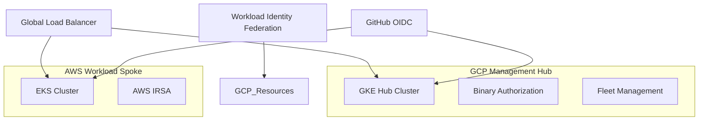

# OpsNexus: Sovereign Multi-Cloud IDP & DevSecOps Lifecycle

## 🎯 Overview
OpsNexus is a production-grade **Internal Developer Platform (IDP)** designed with a "Security Overdrive" approach. This project demonstrates how to architect a hardened, multi-cloud environment using **GKE (Hub)** and **EKS (Spoke)** with a unified identity and security plane.

## 🏗️ Architecture

## 🛠️ Key Engineering Features

### 1. Sovereign Supply Chain (DevSecOps)
- **Image Signing**: All containers are signed using `Cosign` and **Cloud KMS HSM** hardware keys.
- **Attestation Enforcement**: GKE **Binary Authorization** is configured to block any container that lacks a valid cryptographic signature and SLSA provenance.
- **SLSA Level 3**: Every build generates verifiable provenance using **Google Cloud Build**.

### 2. Multi-Cloud Zero-Trust
- **Identity Bridge**: Establish a trust relationship between GCP and AWS using **Connected Clusters**.
- **IRSA & Workload Identity**: Securely access AWS DynamoDB and GCP Secret Manager without static credentials.

### 3. Hardened Networking
- **Private Clusters**: 100% private GKE/EKS nodes with no public internet exposure.
- **Global Load Balancing**: A single, scalable entry point for all multi-cloud traffic using Google Global LB.

## 🚀 Deployment Guide
1.  **Phase 0 (Bootstrap)**: Initialize `infra/bootstrap` to set up KMS and State management.
2.  **Phase 1 (Infra)**: Deploy `infra/gcp` and `infra/aws` modules.
3.  **Phase 2 (Platform)**: Apply GitOps manifests from `platform/config-sync`.
4.  **Phase 3 (Deploy)**: Run the `.github/workflows` to build and sign your secure applications.

---
*Created by [Your Name] - DevOps & Security Portfolio Project*
