# Multi-Cloud Internal Developer Platform


  


---

## Architecture

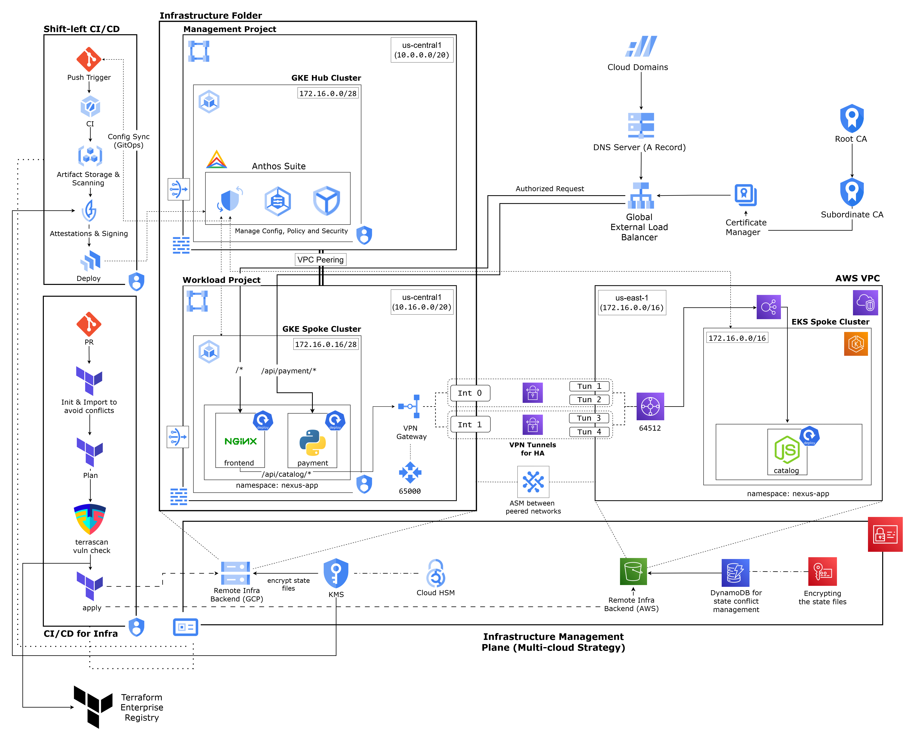

---

## Table of Contents

1. [Project Overview](#project-overview)
2. [Design Decisions](#design-decisions)
3. [Infrastructure Components](#infrastructure-components)
4. [Security Posture](#security-posture)
5. [CI/CD and Supply Chain](#cicd-and-supply-chain)
6. [Networking](#networking)
7. [Platform Engineering Layer](#platform-engineering-layer)
8. [Replication Guide](#replication-guide)
9. [Limitations and Trade-offs](#limitations-and-trade-offs)
10. [Cost Profile](#cost-profile)

---

## Project Overview

OpsNexus is a production-grade, multi-cloud Internal Developer Platform built on GCP and AWS. It demonstrates end-to-end platform engineering across three disciplines: infrastructure security, supply chain integrity, and developer self-service.

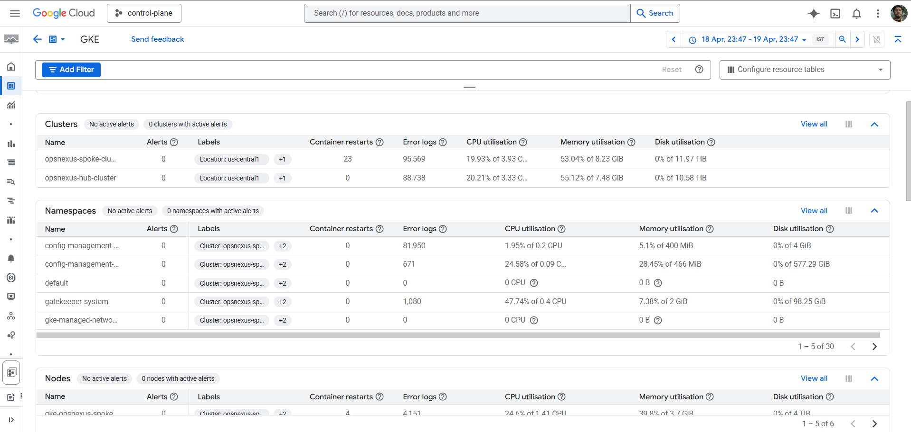

The platform hosts a three-tier storefront application: a frontend (nginx, GKE), a payment service (Python/Flask, GKE), and a catalog service (Node.js, EKS). Each tier is independently deployable, independently attestable, and independently rollbackable.

The primary engineering objectives driving every decision in this project are:

- **Supply chain integrity**: No unattested image reaches a production cluster.
- **Zero standing credentials**: Every workload authenticates via federated identity, not API keys.
- **Separation of concerns**: Management plane (control project) is isolated from the workload plane (data project).
- **GitOps as the source of truth**: Cluster state is reconciled from Git, not applied ad-hoc.
The platform uses a hub-and-spoke model with two GCP projects and one AWS account.
### VPC Architecture

The control and data VPCs are peered bidirectionally. Custom routes are exported and imported to allow pod CIDRs to be reachable across VPCs. This is required for Fleet membership communication and for the GKE Hub cluster to participate in the same service mesh.

Pod CIDRs are non-overlapping by design:

| VPC | Node CIDR | Pod CIDR | Service CIDR |
| --- | --------- | -------- | ------------ |
| Control | 10.0.0.0/20 | 10.1.0.0/16 | 10.2.0.0/20 |
| Data | 10.16.0.0/20 | 10.17.0.0/16 | 10.18.0.0/20 |
| AWS | 10.20.0.0/16 | 10.21.0.0/16 | -- |

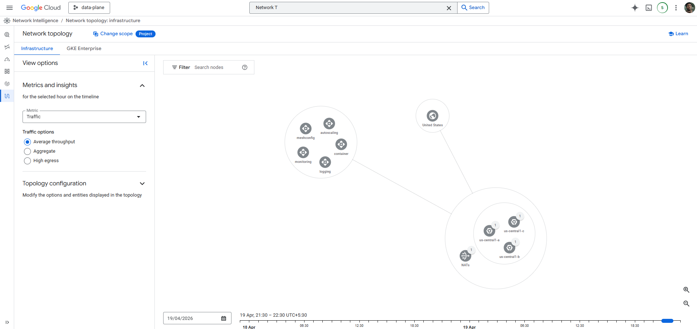
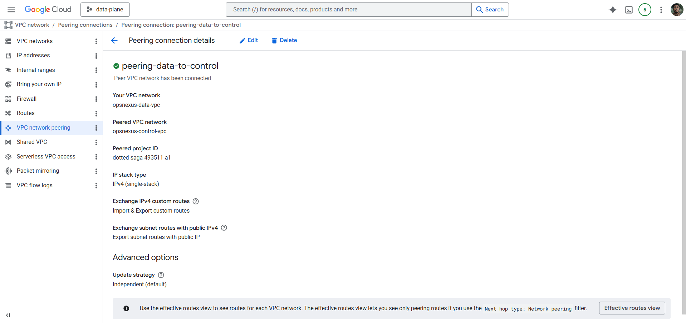

### Site-to-Site VPN

A High Availability VPN gateway in the data VPC connects to an AWS Virtual Private Gateway via two IPSec tunnels. BGP is used for dynamic routing. Both tunnels must be established for the HA configuration to function; a single tunnel failure does not interrupt connectivity.

The VPN enables the GKE frontend pod to proxy catalog requests to the EKS cluster's internal NLB endpoint over an encrypted private channel rather than the public internet.

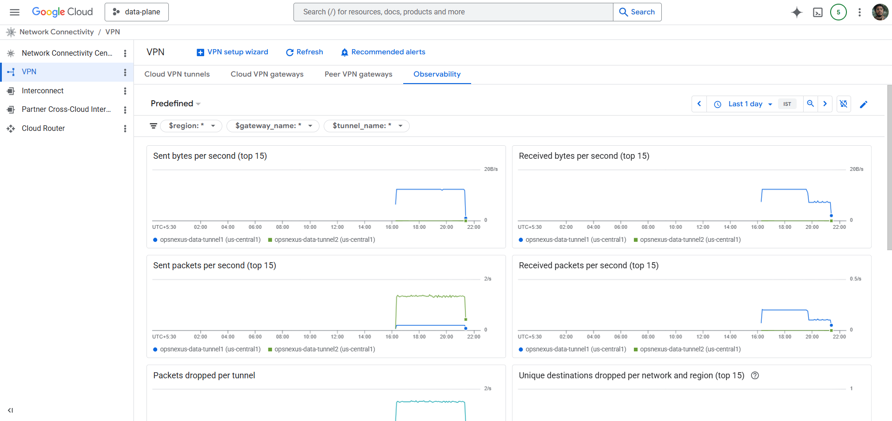
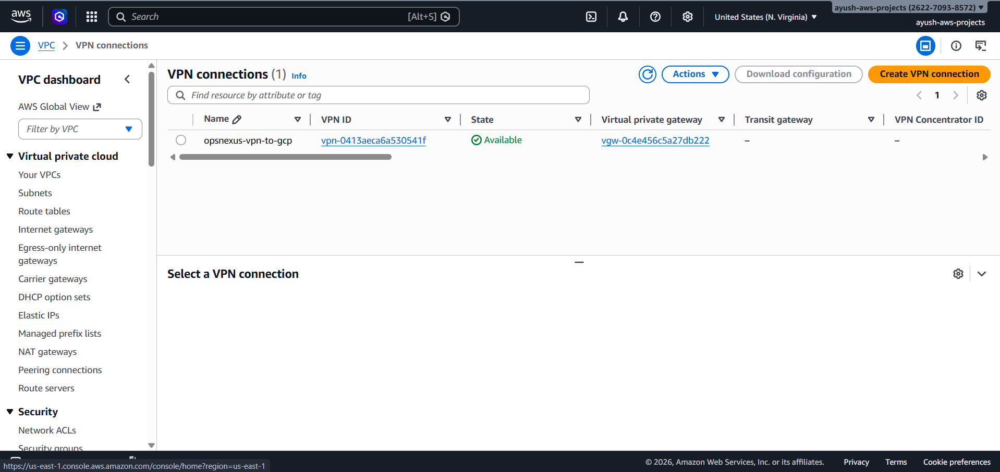

### Global Load Balancer

The Google Cloud Global LB is the single ingress point for user traffic. It uses container-native load balancing with zonal Network Endpoint Groups, routing directly to pod IPs across three zones (us-central1-a, us-central1-b, us-central1-c). Path-based routing separates frontend and payment traffic at the LB layer:

- /api/payment/* routes to the payment backend service (port 8080 NEG)
- All other paths route to the frontend backend service (port 80 NEG)
- /api/catalog/* is handled by nginx within the frontend pod, which proxies to the EKS NLB via the VPN

GFE health check probes (source ranges 130.211.0.0/22 and 35.191.0.0/16) are permitted to reach pod ports 80 and 8080 via a VPC firewall rule targeting the gke-node tag. Istio mTLS is set to PERMISSIVE on these ports at the workload level specifically to allow plain HTTP health checks, while all other inter-service traffic remains STRICT mTLS.

---

## Platform Engineering Layer

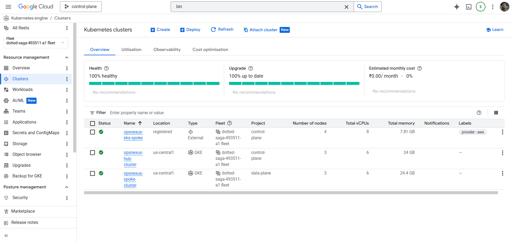
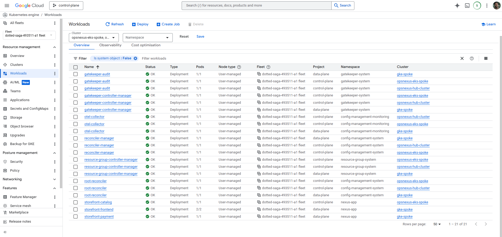

### Config Sync

Config Sync reconciles the platform/ directory from the prod branch of this repository onto all GKE clusters registered in the Fleet. The repository uses a hierarchical structure:

```text
platform/config-sync/
  cluster/                    # Cluster-scoped resources (applied to all clusters)
    policy-controller/        # OPA constraint templates and constraints
  namespaces/
    nexus-app/                # Namespace-scoped resources for the workload namespace
      namespace.yaml          # PSS labels, namespace definition
      network-policy.yaml     # NetworkPolicy rules
      peer-authentication.yaml # Istio mTLS mode
      resource-quota.yaml     # Namespace resource limits
      limitrange.yaml         # Per-container defaults
      poddisruptionbudgets.yaml
      configmap-catalog-endpoint.yaml # EKS NLB URL (non-sensitive config)
```

Changes to cluster security policy, network policy, or RBAC are made via pull request to this directory. Config Sync detects the change within 30 seconds and reconciles the cluster state. There is no manual kubectl apply for platform configuration.

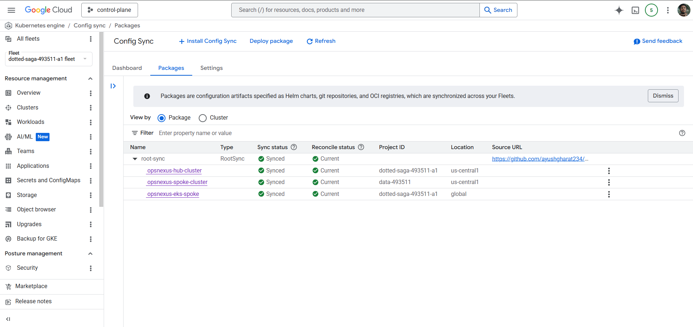

### Policy Controller

Policy Controller enforces the following constraints across all fleet clusters:

- K8sRequiredLabels: all namespaces must declare an owner label
- Pod Security Standards via PSS admission (restrict mode at namespace level)
- Policy Essentials v2022 bundle: CIS Kubernetes Benchmark guardrails

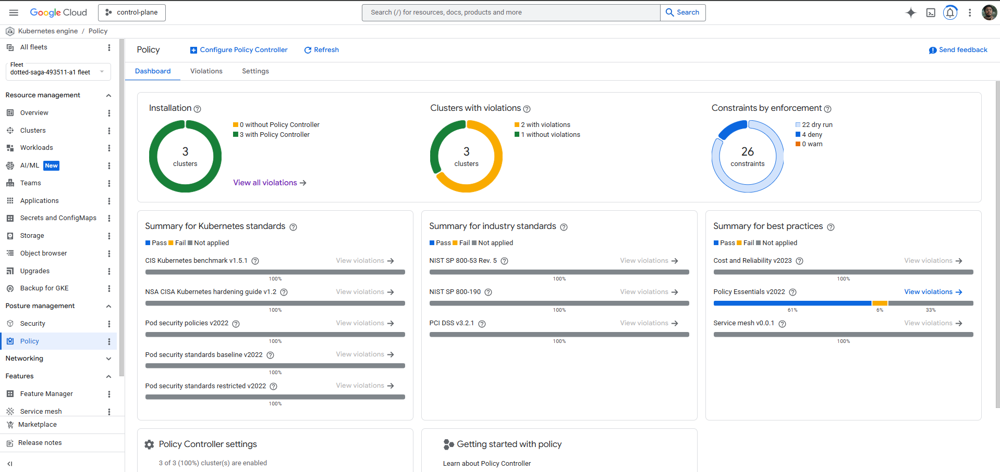
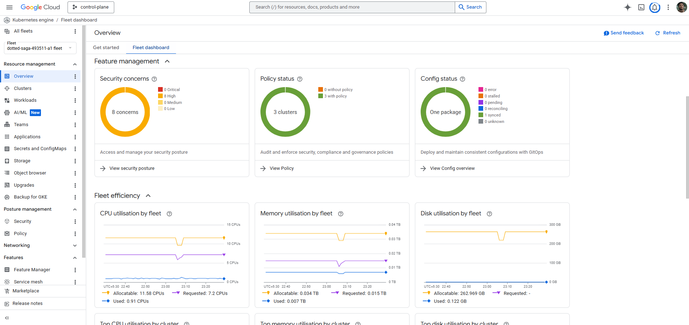

### Fleet Observability

Fleet Observability is configured with COPY mode for per-cluster logs (each cluster's logs remain in its own project) and MOVE mode for fleet-scoped logs (aggregated to the Fleet host project). This allows per-cluster debugging while maintaining a unified audit trail.

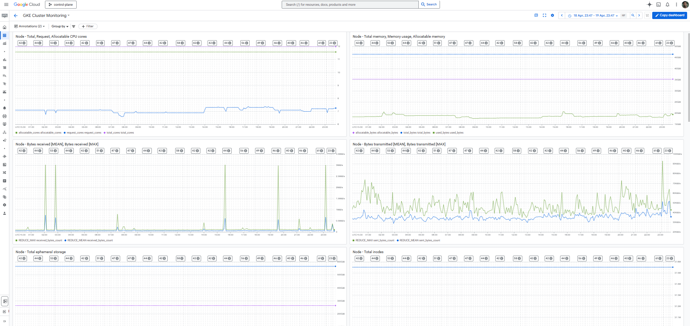
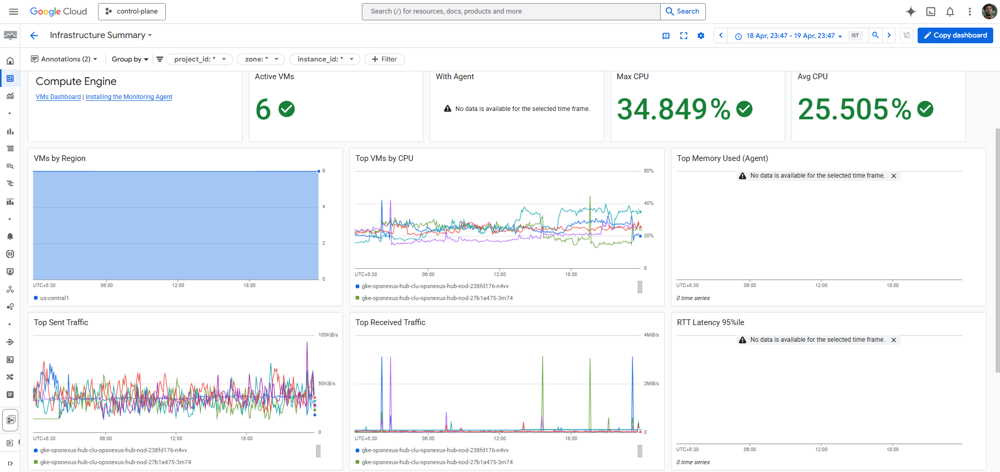

---

## Replication Guide

### Prerequisites

- Two GCP projects (one control, one data) with billing enabled
- One AWS account
- A GCS bucket for Terraform state (update backend.tf in each module)
- A GitHub repository (for Config Sync and WIF attribute condition)

### Phase 0: Bootstrap

```bash
# Create GCS state buckets manually or via bootstrap script
gsutil mb -l us-central1 gs://your-tfstate-bucket
```

### Phase 1: Infrastructure

```bash
# GCP
cd infra/gcp
cp terraform.tfvars.example terraform.tfvars
# Edit terraform.tfvars with your project IDs, project numbers, GitHub repo

terraform apply -target=module.kms -target=module.identity
terraform apply -target=module.gke_hub -target=module.gke_spoke
terraform apply -target=module.fleet
terraform apply -target=module.lb

# AWS (after GCP VPN gateway is provisioned)
cd infra/aws
terraform apply

# GCP Phase 3: wire VPN tunnels
cd infra/gcp
terraform apply -target=module.vpn_data -var-file=terraform.tfvars
```

### Phase 2: Platform

Push the platform/config-sync directory to your repository. Config Sync will reconcile all resources within 60 seconds of the Fleet membership being established.

### Phase 3: CI/CD

Create Cloud Build triggers pointing to your repository with path filters:

- apps/storefront/frontend/** --> ci-trigger-frontend
- apps/storefront/payment/** --> ci-trigger-payment
- apps/storefront/catalog/** --> ci-trigger-catalog

Apply the Cloud Deploy pipeline definitions:

```bash
gcloud deploy apply --file=apps/cloud-deploy/frontend-pipeline.yaml --region=us-central1
gcloud deploy apply --file=apps/cloud-deploy/payment-pipeline.yaml --region=us-central1
gcloud deploy apply --file=apps/cloud-deploy/catalog-pipeline.yaml --region=us-central1
```

### Phase 4: Wire NEGs to Load Balancer

After the first successful Cloud Deploy release, the NEG annotation on the services will have created zonal NEGs. Wire them to the LB:

```bash
gcloud compute network-endpoint-groups list \
  --filter="name:frontend-neg OR name:payment-neg" \
  --format="value(selfLink)" --project=<data-project>

# Then terraform apply with the NEG self-links as frontend_neg_ids / payment_neg_ids variables
```

---

## Limitations and Trade-offs

### No Organization Node

This project operates without a GCP organization. This has several downstream consequences:

**Shared VPC is unavailable.** In an enterprise setup, the recommended pattern is a Shared VPC host project for networking, with service projects for workloads. This eliminates VPC peering (which does not scale beyond a small number of project pairs), centralises firewall management, and reduces the IAM surface area. This project approximates the pattern with explicit VPC peering and cross-project IAM bindings, which works but requires more manual IAM management.

**VPC Service Controls are unavailable.** Without an organization, VPC Service Controls perimeters cannot be created. VPC Service Controls would prevent exfiltration of data from Artifact Registry, Secret Manager, and Cloud KMS even if a workload is compromised. This is a meaningful gap for a production deployment.

**Organization Policies are unavailable.** Constraints such as `constraints/compute.requireShieldedVm`, `constraints/iam.disableServiceAccountKeyCreation`, and `constraints/compute.restrictCloudNATUsage` cannot be enforced at scale without an org node. These are enforced manually in this project via Terraform and PSS.

### GKE Standard vs GKE Enterprise

The project uses GKE Standard with Anthos/Fleet features enabled selectively. GKE Enterprise (formerly Anthos) would provide:

**Multi-cluster Ingress (MCI)**: A single Ingress resource that spans multiple GKE clusters, managed by the Fleet Ingress controller. In this project, the Global LB is manually configured with NEGs from a single cluster. MCI would allow traffic splitting across the hub and spoke clusters.

**Config Controller**: A managed Config Sync and Policy Controller instance that runs outside any cluster, enabling management of GCP resources (not just Kubernetes resources) via GitOps using Config Connector. This would allow the Terraform layer to be replaced or augmented with GitOps-managed GCP resources.

**Advanced multi-cluster service mesh**: The current setup has managed ASM on GKE clusters only. EKS is joined to the fleet but does not participate in the service mesh. GKE Enterprise with GKE Attached Clusters would allow the EKS catalog service to participate in the same mTLS fabric, eliminating the nginx proxy_pass workaround for catalog traffic.

### EKS Integration Depth

The EKS cluster is registered as a Fleet membership (not a GKE Attached Cluster). As a result:

- Binary Authorization does not enforce on EKS. The catalog image is attested by Cloud Build but that attestation is not verified at pod admission on EKS. The GAR pull secret model is used as a coarser control.
- EKS pods do not participate in the Istio service mesh. Catalog-to-payment communication (if it existed) would not be mTLS protected at the sidecar layer.
- Fleet Observability does not collect EKS workload metrics natively.

Registering as a GKE Attached Cluster would address the first limitation. Full service mesh participation on EKS requires Istio to be installed on the EKS cluster and joined to the managed ASM control plane, which is a more involved operation.

### Spot VMs

All GKE node pools use Spot VMs for cost efficiency. Spot VMs can be evicted with 30 seconds notice. PodDisruptionBudgets ensure at least one replica survives a node eviction, but a simultaneous eviction of all nodes in a zone would cause a brief outage. For production, at least one node pool of standard VMs with a minimum node count should be maintained.

### TLS Termination

The Global LB currently operates in HTTP mode. Certificate Manager with DNS-authorized certificates is configured in the Terraform module and activates when a domain variable is provided. Without a registered domain, TLS cannot be provisioned. In production, this gap would be closed by registering a domain and delegating DNS to Cloud DNS.

### VPN Tunnel Status

The HA VPN gateway is provisioned with two tunnel interfaces. The IPSec tunnels require both the GCP-side and AWS-side configurations to be applied with matching pre-shared keys and BGP ASNs. If the tunnels show as inactive in the console, verify that the AWS Virtual Private Gateway is in the attached state and that both BGP sessions have established. The VPN does not affect GKE workload availability but does affect the catalog service's ability to be reached over the private channel.

### Single Region

All GKE workloads run in us-central1. The Global LB is global but the backends are regional. A regional outage would make the application unavailable. Multi-region replication would require additional GKE clusters, a database replication strategy, and Global LB backend groups in multiple regions.

---

## Cost Profile

This project is designed for a portfolio/demo context and uses the following cost-reduction measures:

- Spot VMs for all GKE nodes (approximately 60-80% cheaper than standard VMs)
- Minimum node counts (1 node per pool)
- e2-standard-2 machine type (2 vCPU, 8GB RAM)
- No Cloud SQL, Memorystore, or other managed data services
- GKE Standard (not GKE Enterprise, which carries a per-cluster management fee)

Estimated monthly cost at minimum scale: approximately $150-200 USD, dominated by GKE cluster management fees and NAT gateway egress.

---

## Repository Structure

```text
.
|-- apps/
|   |-- storefront/
|   |   |-- frontend/          # nginx reverse proxy, GKE
|   |   |-- payment/           # Python/Flask, GKE
|   |   `-- catalog/           # Node.js, EKS
|   `-- cloud-deploy/          # Delivery pipeline and target definitions
|-- cicd/
|   |-- cloudbuild-frontend.yaml
|   |-- cloudbuild-payment.yaml
|   `-- cloudbuild-catalog.yaml
|-- infra/
|   |-- gcp/                   # Root GCP Terraform module
|   |-- aws/                   # Root AWS Terraform module
|   `-- modules/
|       |-- gcp/
|       |   |-- gke/           # GKE cluster and node pool
|       |   |-- vpc/           # VPC, subnets, Cloud NAT, Cloud Router
|       |   |-- kms/           # Key rings, crypto keys
|       |   |-- identity/      # WIF pool, CI service account, IAM
|       |   |-- fleet/         # Fleet membership, Config Sync, Policy Controller, ASM
|       |   |-- lb/            # Global LB, backend services, health checks, DNS
|       |   `-- vpn/           # HA VPN gateway, tunnels, BGP
|       `-- aws/
|           |-- eks/           # EKS cluster, node groups, IRSA
|           `-- fleet-connect/ # GKE Connect agent deployment
|-- platform/
|   `-- config-sync/           # GitOps manifests (Config Sync source of truth)
|       |-- cluster/           # Cluster-scoped resources
|       `-- namespaces/        # Namespace-scoped resources
`-- skaffold.yaml              # Cloud Deploy renderer configuration
```

---

## Author

Ayush Gharat
Platform Engineering and DevSecOps Portfolio Project
